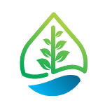
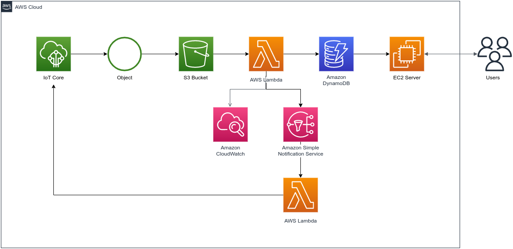

<!-- Improved compatibility of back to top link: See: https://github.com/othneildrew/Best-README-Template/pull/73 -->
<a name="readme-top"></a>
<!--
*** Thanks for checking out the Best-README-Template. If you have a suggestion
*** that would make this better, please fork the repo and create a pull request
*** or simply open an issue with the tag "enhancement".
*** Don't forget to give the project a star!
*** Thanks again! Now go create something AMAZING! :D
-->

<!-- PROJECT SHIELDS -->
<!--
*** I'm using markdown "reference style" links for readability.
*** Reference links are enclosed in brackets [ ] instead of parentheses ( ).
*** See the bottom of this document for the declaration of the reference variables
*** for contributors-url, forks-url, etc. This is an optional, concise syntax you may use.
*** https://www.markdownguide.org/basic-syntax/#reference-style-links
-->
[![Contributors][contributors-shield]][contributors-url]
[![Forks][forks-shield]][forks-url]
[![Stargazers][stars-shield]][stars-url]
[![Issues][issues-shield]][issues-url]
[![MIT License][license-shield]][license-url]
[![LinkedIn][linkedin-shield]][linkedin-url]

<!-- PROJECT LOGO -->
<br />
<div align="center">
  <a href="https://github.com/codewithlennylen/mewater-dashboard">
    
  </a>

<h3 align="center">MeWater</h3>

  <p align="center">
    MeWater is a water conservation solution that uses IoT Devices (Solenoid Valves, Flow Meters, etc) to detect and monitor water leakages in realtime. The system auto-shuts down detected leakage lines thus saving on water.
    <br />
    <a href="https://github.com/codewithlennylen/mewater-dashboard"><strong>Explore the docs »</strong></a>
    <br />
    <br />
    <a href="https://github.com/codewithlennylen/mewater-dashboard">View Demo</a>
    ·
    <a href="https://github.com/codewithlennylen/mewater-dashboard/issues">Report Bug</a>
    ·
    <a href="https://github.com/codewithlennylen/mewater-dashboard/issues">Request Feature</a>
  </p>
</div>

<!-- TABLE OF CONTENTS -->
<details>
  <summary>Table of Contents</summary>
  <ol>
    <li>
      <a href="#about-the-project">About The Project</a>
      <ul>
        <li><a href="#built-with">Built With</a></li>
      </ul>
    </li>
    <li>
      <a href="#getting-started">Getting Started</a>
      <ul>
        <li><a href="#prerequisites">Prerequisites</a></li>
        <li><a href="#installation">Installation</a></li>
      </ul>
    </li>
    <li><a href="#usage">Usage</a></li>
    <li><a href="#roadmap">Roadmap</a></li>
    <li><a href="#contributing">Contributing</a></li>
    <li><a href="#license">License</a></li>
    <li><a href="#contact">Contact</a></li>
    <li><a href="#acknowledgments">Acknowledgments</a></li>
  </ol>
</details>

<!-- ABOUT THE PROJECT -->
## About The Project

<br/>

<div align="center">
  <a href="https://github.com/codewithlennylen/mewater-dashboard">
    
  </a>
</div>

<p align="right">(<a href="#readme-top">back to top</a>)</p>

### Built With

* [![Bootstrap][Bootstrap.com]][Bootstrap-url]
* [![Python][Python]][Python-url]
  * [![Flask][Flask]][flask-url]
* [![AWS][AWS]][aws-url]

<p align="right">(<a href="#readme-top">back to top</a>)</p>

<!-- GETTING STARTED -->
## Getting Started

To get a local copy up and running follow these simple example steps.

<br/>

### Prerequisites

This dashboard relies on **AWS components** and thus needs to connect to them to display data.

The cloud architecture diagram is as shown below. [Read more here.](https://github.com/codewithlennylen/mewater-cloud)

<div align="center">
  <a href="https://github.com/codewithlennylen/mewater-cloud">
    
  </a>
</div>

<br/>

### Installation

1. Clone the repo

   ```sh
   git clone https://github.com/codewithlennylen/mewater-dashboard.git
   ```

2. Navigate to the `code-base` directory

   ```sh
   cd code-base/
   ```

3. [Linux Systems] Install Python Venv Package

   ```sh
   pip3 install python3-venv
   ```

4. Create Virtual Environment

   ```sh
   python3 -m venv venv
   ```

5. Activate Virtual Environment

   \[Linux]
   ```sh
   source venv/bin/activate
   ```
   \[Windows]
    ```sh
   source venv/scripts/activate
   ```
   
5. Install project requirements

   ```sh
   pip3 install -r requirements.txt
   ```

5. Navigate to `app` Directory

   ```sh
   cd app/
   ```

6. Edit the `.env` file to include your AWS Access Credentials & Database URI (use the editor of your choosing)

   ```sh
   sudo nano .env
   ```

7. Navigate back to `code-base` Directory

   ```sh
   cd ..
   ```

8. Run project

   ```sh
   flask run
   ```

<p align="right">(<a href="#readme-top">back to top</a>)</p>

<!-- USAGE EXAMPLES -->
## Usage

<div align="center">
  <a href="https://github.com/codewithlennylen/mewater-dashboard">
    
  </a>
</div>

<br/>

The Dashboard has charts that display the system's state. i.e. Current water consumption, as well as whether any leaks have been detected.

<br/>

<div align="center">
  <a href="https://github.com/codewithlennylen/mewater-dashboard">
    
  </a>
</div>

<br/>

As explained in the [MeWater Cloud Setup](https://github.com/codewithlennylen/mewater-cloud), once a leak is detected an SMS & Email are sent to the user informing them of the incident. Additionally, a `shutdown` command is sent to the IoT devices (valves in this case) to turn off the line with the detected leakage.

### Recommended Resources

* [MeWater Cloud Setup](https://github.com/codewithlennylen/mewater-cloud)
* [MeWater IoT Setup](https://github.com/FanuelConrad/MeWater)
* [MeWater IoT Blog Post](https://fanuelconrad.hashnode.dev/mewater-part-1)

<p align="right">(<a href="#readme-top">back to top</a>)</p>

<!-- ROADMAP -->
## Roadmap

* [ ] Make dashboard dynamic by using live charts
  * [ ] Asynchronous Data Fetching
* [ ] Add more charts - track longer periods of time
* [ ] User management system (AWS Cognito)

See the [open issues](https://github.com/codewithlennylen/mewater-dashboard/issues) for a full list of proposed features (and known issues).

<p align="right">(<a href="#readme-top">back to top</a>)</p>

<!-- CONTRIBUTING -->
## Contributing

Contributions are what make the open source community such an amazing place to learn, inspire, and create. Any contributions you make are **greatly appreciated**.

If you have a suggestion that would make this better, please fork the repo and create a pull request. You can also simply open an issue with the tag "enhancement".
Don't forget to give the project a star! Thanks again!

1. Fork the Project
2. Create your Feature Branch (`git checkout -b feature/AmazingFeature`)
3. Commit your Changes (`git commit -m 'Add some AmazingFeature'`)
4. Push to the Branch (`git push origin feature/AmazingFeature`)
5. Open a Pull Request

<p align="right">(<a href="#readme-top">back to top</a>)</p>

<!-- LICENSE -->
## License

Distributed under the MIT License. See `LICENSE.txt` for more information.

<p align="right">(<a href="#readme-top">back to top</a>)</p>

<!-- CONTACT -->
## Contact

Your Name - [@codewithlenny](https://twitter.com/codewithlenny) - codewithlennylen254@gmail.com

Project Link: [https://github.com/codewithlennylen/mewater-dashboard](https://github.com/codewithlennylen/mewater-dashboard)

<p align="right">(<a href="#readme-top">back to top</a>)</p>

<!-- ACKNOWLEDGMENTS -->
## Acknowledgments

* [Fanuel Conrad](https://github.com/FanuelConrad) - IoT Lead

<p align="right">(<a href="#readme-top">back to top</a>)</p>

<!-- MARKDOWN LINKS & IMAGES -->
<!-- https://www.markdownguide.org/basic-syntax/#reference-style-links -->
[contributors-shield]: https://img.shields.io/github/contributors/codewithlennylen/mewater-dashboard.svg?style=for-the-badge
[contributors-url]: https://github.com/codewithlennylen/mewater-dashboard/graphs/contributors
[forks-shield]: https://img.shields.io/github/forks/codewithlennylen/mewater-dashboard.svg?style=for-the-badge
[forks-url]: https://github.com/codewithlennylen/mewater-dashboard/network/members
[stars-shield]: https://img.shields.io/github/stars/codewithlennylen/mewater-dashboard.svg?style=for-the-badge
[stars-url]: https://github.com/codewithlennylen/mewater-dashboard/stargazers
[issues-shield]: https://img.shields.io/github/issues/codewithlennylen/mewater-dashboard.svg?style=for-the-badge
[issues-url]: https://github.com/codewithlennylen/mewater-dashboard/issues
[license-shield]: https://img.shields.io/github/license/codewithlennylen/mewater-dashboard.svg?style=for-the-badge
[license-url]: https://github.com/codewithlennylen/mewater-dashboard/LICENSE
[linkedin-shield]: https://img.shields.io/badge/-LinkedIn-black.svg?style=for-the-badge&logo=linkedin&colorB=555
[linkedin-url]: https://linkedin.com/in/lenny-nganga-wanjiru
[Bootstrap.com]: https://img.shields.io/badge/Bootstrap-563D7C?style=for-the-badge&logo=bootstrap&logoColor=white
[Bootstrap-url]: https://getbootstrap.com
[Flask]: https://img.shields.io/badge/Flask-000000?style=for-the-badge&logo=flask&logoColor=white
[flask-url]: https://flask.palletsprojects.com/en/2.2.x/
[AWS]: https://img.shields.io/badge/Amazon_AWS-FF9900?style=for-the-badge&logo=amazonaws&logoColor=white
[aws-url]: https://aws.amazon.com/
[Python]: https://img.shields.io/badge/Python-3776AB?style=for-the-badge&logo=python&logoColor=white
[Python-url]: https://www.python.org/
